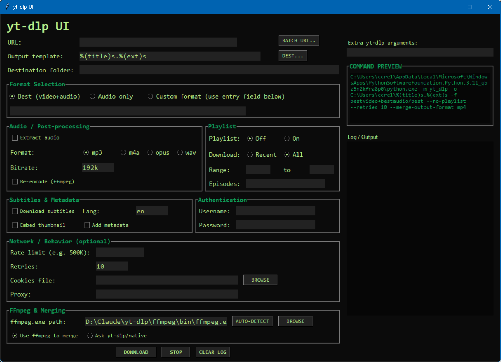

# yt-dlp UI

A modern, user-friendly graphical interface for [yt-dlp](https://github.com/yt-dlp/yt-dlp), the powerful YouTube and video platform downloader.



## Features

### Core Functionality
- **Simple URL Download** - Paste any video URL and download
- **Batch Downloads** - Load a text file with multiple URLs
- **Format Selection** - Choose best quality, audio only, or custom formats
- **Playlist Support** - Download entire playlists, specific ranges, or individual episodes
- **Audio Extraction** - Convert to MP3, M4A, Opus, or WAV with custom bitrate
- **Live Command Preview** - See the exact yt-dlp command before downloading
- **Real-time Logging** - Monitor download progress in the built-in console

### Advanced Features
- **Subtitle Downloads** - Download and embed subtitles in multiple languages
- **Metadata & Thumbnails** - Embed video thumbnails and metadata automatically
- **Authentication** - Bypass age restrictions with login credentials or cookies
- **Network Controls** - Rate limiting, proxy support, retry configuration
- **Custom Output Templates** - Full control over file naming and organization

## Download & Installation

### Option 1: Portable Executable (Recommended for Most Users)

**No Python installation required!**

1. Download `yt-dlp-ui-portable.zip` from [Releases](https://github.com/wiirdoproductions/yt-dlp-ui/releases)
2. Extract the ZIP file to any folder
3. Run `yt-dlp-ui.exe`
4. Start downloading!

The portable version includes:
- Pre-configured executable
- Bundled ffmpeg (no separate installation needed)
- All dependencies included

**System Requirements:**
- Windows 10/11 (64-bit)
- Internet connection

### Option 2: Run from Source (For Developers)

**Requirements:**
- Python 3.8 or higher
- pip (Python package manager)

**Installation Steps:**

1. Clone this repository:
```bash
git clone https://github.com/wiirdoproductions/yt-dlp-ui.git
cd yt-dlp-ui
```

2. Install yt-dlp:
```bash
pip install yt-dlp
```

3. Download and install ffmpeg:
   - Download from [ffmpeg.org](https://ffmpeg.org/download.html) or [gyan.dev](https://www.gyan.dev/ffmpeg/builds/)
   - Extract to a folder and add to your system PATH
   - Or use the Browse button in the app to locate ffmpeg.exe

4. Run the application:
```bash
python yt_dlp_ui.py
```

## Usage Guide

### Basic Download

1. **Enter URL** - Paste the video URL in the top field
2. **Choose Destination** - Click "DEST..." to select where to save files
3. **Select Format** - Choose "Best (video+audio)", "Audio only", or "Custom format"
4. **Click DOWNLOAD** - Watch the progress in the log console

### Playlist Downloads

The Playlist section offers flexible options:

- **Playlist: Off** - Download only the single video (ignore playlist)
- **Playlist: On + All** - Download entire playlist
- **Playlist: On + Recent** - Download only the most recent video
- **Range** - Download specific range (e.g., 5 to 10)
- **Episodes** - Download specific videos (e.g., `1,3,5` or `1,3-5,7`)

### Audio Extraction

1. Check "Extract audio"
2. Select format (MP3, M4A, Opus, WAV)
3. Set bitrate (default: 192k)
4. Optionally enable "Re-encode (ffmpeg)" for format conversion

### Bypassing Age Restrictions

**Method 1: Cookies (Recommended)**
1. Install browser extension "Get cookies.txt LOCALLY" (Chrome/Firefox)
2. Log into YouTube in your browser
3. Export cookies using the extension
4. In the app, browse to your cookies.txt file in "Network / Behavior" section

**Method 2: Direct Login**
1. Enter username and password in the "Authentication" section
2. Note: Less reliable for Google accounts, may trigger security warnings

### Subtitles

1. Check "Download subtitles"
2. Set language code (e.g., `en` for English, `es` for Spanish)
3. Optionally check "Embed thumbnail" and "Add metadata"

### Custom Arguments

Use the "Extra yt-dlp arguments" field for advanced options not covered by the UI.
Example: `--write-description --write-info-json`

See [yt-dlp documentation](https://github.com/yt-dlp/yt-dlp#usage-and-options) for all available options.

## Building from Source

To create your own executable:

1. Install requirements:
```bash
pip install pyinstaller yt-dlp
```

2. Download ffmpeg and extract to `ffmpeg\bin\ffmpeg.exe` in the project directory

3. Run the build script:
```bash
build_executable.bat
```

The executable will be created in the `dist` folder.

## Supported Sites

yt-dlp supports 1800+ websites including:
- YouTube, Vimeo, Twitch
- Facebook, Instagram, Twitter/X
- TikTok, Reddit, SoundCloud
- Educational sites (Coursera, Khan Academy, etc.)
- And many more...

See the [full list of supported sites](https://github.com/yt-dlp/yt-dlp/blob/master/supportedsites.md).

## Troubleshooting

### "FFmpeg not found"
- **Portable version**: FFmpeg should be automatically detected
- **Source version**: Download ffmpeg and use the "AUTO-DETECT" or "BROWSE" button

### "HTTP Error 403" or "This video is unavailable"
- Video may be age-restricted: Use cookies file method
- Video may be region-locked: Try using a proxy in "Network / Behavior"
- Video may require login: Use authentication or cookies

### Downloads are slow
- Use the "Rate limit" option to avoid throttling
- Try a different time of day
- Check your internet connection

### Antivirus flags the executable
- This is a common false positive with PyInstaller executables
- You can verify the source code is safe by inspecting this repository
- Add an exception in your antivirus software

## License

This project is licensed under the MIT License - see the [LICENSE](LICENSE) file for details.

### Third-Party Software

This application uses the following open-source software:

**yt-dlp** - [Unlicense License](https://github.com/yt-dlp/yt-dlp/blob/master/LICENSE)
> A youtube-dl fork with additional features and fixes

**FFmpeg** - [LGPL 2.1 License](https://www.ffmpeg.org/legal.html)
> A complete, cross-platform solution to record, convert and stream audio and video

FFmpeg binaries are included in the portable distribution under the terms of the LGPL 2.1 license. The source code for FFmpeg is available at [ffmpeg.org](https://ffmpeg.org/download.html).

## Credits

- **yt-dlp**: https://github.com/yt-dlp/yt-dlp
- **FFmpeg**: https://ffmpeg.org/
- **Python**: https://www.python.org/
- **Tkinter**: Python's standard GUI library

## Disclaimer

This tool is for personal use only. Please respect copyright laws and the terms of service of the websites you download from. The developers are not responsible for any misuse of this software.

## Support

- **Issues**: [Report bugs or request features](https://github.com/wiirdoproductions/yt-dlp-ui/issues)
- **yt-dlp Documentation**: https://github.com/yt-dlp/yt-dlp
- **FFmpeg Documentation**: https://ffmpeg.org/documentation.html

## Contributing

Contributions are welcome! Feel free to:
- Report bugs
- Suggest new features
- Submit pull requests
- Improve documentation

---

**Made with ❤️ for the community**
